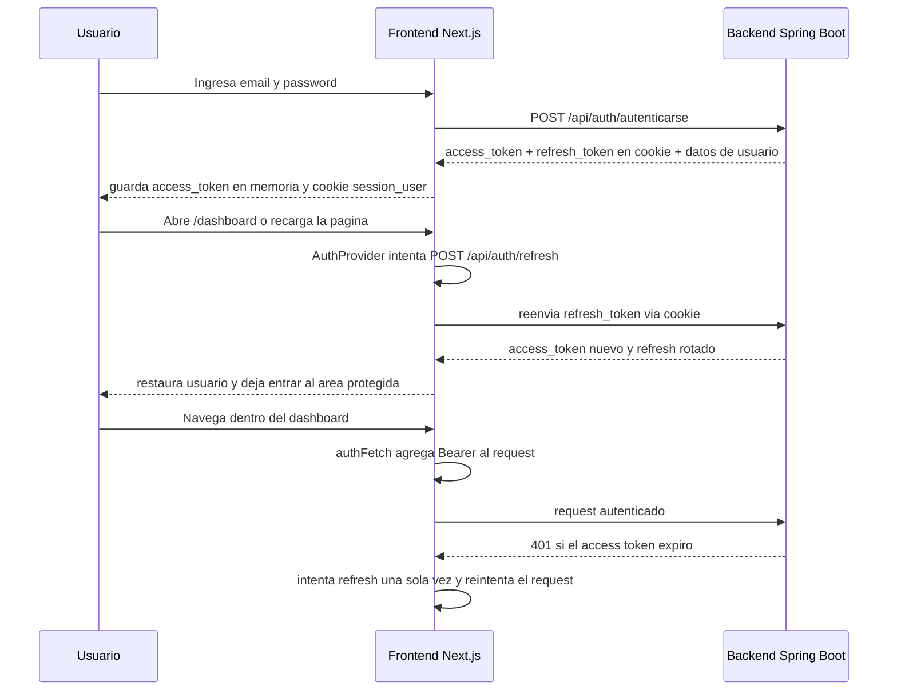

# Sesion, refresh y backend frontend

Este proyecto no maneja la sesion como un simple login estatico. La idea es separar tres piezas:

1. El access token vive solo en memoria en el frontend.
2. El refresh token vive en una cookie HttpOnly.
3. Next.js actua como BFF, o sea, como puente entre el navegador y el backend Spring Boot.

Con eso se logra que el dashboard no se cierre por cada recarga y que las llamadas autenticadas puedan renovarse sin obligar al usuario a volver al login de inmediato.

## Flujo general

## Que pasa al iniciar sesion

El formulario de login esta en [components/login/login.tsx](components/login/login.tsx). Cuando el usuario envia email y password, llama a `login()` del contexto de autenticacion.

Ese `login()` vive en [lib/auth/auth-context.tsx](lib/auth/auth-context.tsx) y hace esto:

1. Hace `POST /api/auth/login`.
2. Guarda el `access_token` en memoria con `setAccessToken()`.
3. Pide el usuario actual con `GET /api/auth/me` usando ese bearer token.
4. Guarda el usuario en el estado global del contexto.

La respuesta de `/api/auth/login` no viene directamente del backend al navegador. La ruta [app/api/auth/login/route.ts](app/api/auth/login/route.ts) actua como intermediario:

1. Recibe email y password.
2. Llama al backend Spring Boot en `/api/auth/autenticarse`.
3. Reenvía la cookie `refresh_token` que manda el backend.
4. Guarda tambien una cookie propia llamada `session_user` para poder reconstruir la sesion despues.

## Donde vive cada cosa

- `access_token`: solo en memoria del navegador. Se define en [lib/auth/token-store.ts](lib/auth/token-store.ts).
- `refresh_token`: cookie HttpOnly. No la puede leer JavaScript.
- `session_user`: cookie del BFF con el usuario serializado. Sirve para restaurar la vista del usuario cuando se refresca la sesion.
- `user` actual: estado del `AuthProvider`.

Esto es importante: como el `access_token` no se guarda en localStorage ni en cookies, si recargas la pagina se pierde. Pero no se pierde la sesion completa porque el refresh token sigue existiendo en la cookie HttpOnly y permite pedir un access token nuevo.

## Que pasa al recargar la pagina

Cuando la app monta, [lib/auth/auth-context.tsx](lib/auth/auth-context.tsx) ejecuta un refresh silencioso:

1. Hace `POST /api/auth/refresh`.
2. El navegador manda automaticamente la cookie `refresh_token`.
3. La ruta [app/api/auth/refresh/route.ts](app/api/auth/refresh/route.ts) la reenvia al backend.
4. Si el backend responde bien, devuelve un `access_token` nuevo.
5. El frontend guarda ese token en memoria y reconstruye el usuario.

Si el refresh falla, el contexto limpia la sesion y deja al usuario fuera.

## Como se evita sacar al usuario del dashboard

La parte clave esta en [lib/auth/auth-fetch.ts](lib/auth/auth-fetch.ts).

Cuando cualquier modulo necesita llamar al backend, no usa `fetch()` directo: usa `authFetch()`.

Ese helper hace dos cosas:

1. Inyecta el header `Authorization: Bearer <access_token>`.
2. Si la respuesta viene con `401`, intenta un refresh una sola vez y repite la misma peticion.

Eso significa que si el access token vence mientras el usuario esta navegando el dashboard, la app normalmente se recupera sola. El usuario ve la pantalla actual y la llamada se reintenta sin romper el flujo.

### Ejemplo practico en dashboard

El dashboard usa [lib/hooks/useDashboard.ts](lib/hooks/useDashboard.ts). Ese hook hace peticiones con `authFetch()`, asi que:

1. Carga datos protegidos con el token actual.
2. Si el token ya vencio, recibe 401.
3. `authFetch()` llama a `/api/auth/refresh`.
4. Si el refresh funciona, reintenta la consulta.
5. El dashboard sigue visible y solo cambia el estado de carga.

Por eso el dashboard no deberia “sacarte” por una expiracion normal del access token.

## Que pasa si el refresh ya no sirve

Si el refresh token expiro o el backend lo invalido, el refresh ya no puede salvar la sesion.

En ese caso:

1. `authFetch()` despacha el evento `auth:session-expired`.
2. `AuthProvider` escucha ese evento.
3. Limpia el access token.
4. Guarda una marca en `sessionStorage` para mostrar el aviso.
5. Llama a `/api/auth/logout` para limpiar cookies.
6. Redirige al login (`/`).

Luego el login detecta la marca `auth:session-expired` y muestra el mensaje de que la sesion vencio.

## Guia corta del backend

El backend trabaja sin sesion HTTP. Todo se sostiene con JWT, una cookie HttpOnly para el refresh token y un contador de version en la tabla `usuario`.

### 1. Login

La ruta [src/main/java/com/sistemapos/sistematextil/controllers/AuthenticationController.java](src/main/java/com/sistemapos/sistematextil/controllers/AuthenticationController.java) recibe `email` y `password` y delega en [src/main/java/com/sistemapos/sistematextil/services/AuthenticationService.java](src/main/java/com/sistemapos/sistematextil/services/AuthenticationService.java).

Flujo resumido:

1. Spring Security valida credenciales.
2. `LoginAttemptService` bloquea por email + IP si hay demasiados fallos. Esto vive en memoria.
3. Se busca el usuario activo por `correo` y `deleted_at IS NULL`.
4. Se valida el turno.
5. Se incrementa `refresh_token_version`.
6. Se genera el access token con `rol`, `idUsuario`, `idSucursal`, `idTurno` y `nombreTurno`.
7. Se genera el refresh token con `refreshVersion`.
8. Se devuelve la cookie `refresh_token` con `HttpOnly`, `Secure`, `SameSite` y duración desde `JwtConfig`.
9. La respuesta del login ya incluye los datos que el frontend necesita para pintar la sesion.

### 2. Refresh

La ruta `POST /api/auth/refresh` toma la cookie `refresh_token`, saca el correo del subject y compara dos cosas:

1. que el token siga vigente,
2. que `refreshVersion` coincida con `usuario.refresh_token_version`.

Si coincide, rota la version otra vez y devuelve access token nuevo + refresh token nuevo. Si no coincide, borra la cookie y fuerza relogin.

### 3. Logout y cambio de password

- `POST /api/auth/logout` incrementa `refresh_token_version` y borra la cookie.
- `POST /api/auth/cambiar-password` tambien incrementa la version para invalidar tokens viejos.
- `GET /api/auth/me` usa el `Authentication` que ya dejo Spring Security, no la cookie.

### 4. Reglas de seguridad

En [src/main/java/com/sistemapos/sistematextil/config/SecurityConfig.java](src/main/java/com/sistemapos/sistematextil/config/SecurityConfig.java) la sesion es `STATELESS`.

Eso implica:

1. no existe `HttpSession`,
2. cada request usa el access token del header `Authorization`,
3. la cookie solo sirve para renovar tokens,
4. el estado durable de autenticacion vive en la base.

## Tablas que intervienen

### `usuario`

Es la tabla central. Se usa para `correo`, `password`, `rol`, `activo`, `deleted_at`, `id_sucursal`, `id_turno`, `foto_perfil_url` y `refresh_token_version`.

### `sucursal`

Aporta la sucursal principal del usuario y la lista de sucursales permitidas.

### `turno`

Define nombre, hora de inicio, hora de fin y estado del turno.

### `turno_dia`

Guarda los dias y horarios que componen el turno.

### `usuario_sucursal`

Tabla puente para asignar sucursales permitidas por usuario.

### Importante

`LoginAttemptService` no usa tabla. Guarda intentos fallidos en memoria con una llave `email + IP` y bloquea por 15 minutos cuando llega al limite.

## Como copiar este patron en otra app

1. Crea una tabla de usuarios con `correo`, `password`, `rol`, `activo`, `deleted_at` y `refresh_token_version`.
2. Modela las relaciones que quieras devolver en login, como usuario-sucursal y usuario-turno.
3. Usa access token corto solo en memoria del frontend.
4. Guarda el refresh token en cookie HttpOnly.
5. Rota `refresh_token_version` en login, refresh, logout y cambio de password.
6. Mantén el backend stateless para que no dependa de sesion de servidor.

## Como protege las rutas

Hay dos layouts importantes:

- [app/(auth)/layout.tsx](app/%28auth%29/layout.tsx): si ya estas autenticado, te manda al dashboard y evita mostrar el login otra vez.
- [app/(protected)/layout.tsx](app/%28protected%29/layout.tsx): si no estas autenticado, te manda al login y mientras carga muestra un overlay.

Eso evita parpadeos raros y evita que un usuario sin sesion vea una pantalla protegida.

## Resumen corto

La estrategia completa es esta:

1. Login crea una sesion en backend y devuelve `access_token`.
2. El access token vive solo en memoria.
3. El refresh token vive en cookie HttpOnly.
4. Al recargar, el frontend intenta refresh silencioso.
5. Las peticiones protegidas usan `authFetch()` para refrescar y reintentar si hace falta.
6. Si el refresh ya no sirve, se cierra la sesion y se vuelve al login.

## Archivos clave

- [lib/auth/auth-context.tsx](lib/auth/auth-context.tsx)
- [lib/auth/auth-fetch.ts](lib/auth/auth-fetch.ts)
- [lib/auth/token-store.ts](lib/auth/token-store.ts)
- [app/api/auth/login/route.ts](app/api/auth/login/route.ts)
- [app/api/auth/refresh/route.ts](app/api/auth/refresh/route.ts)
- [app/api/auth/me/route.ts](app/api/auth/me/route.ts)
- [app/api/auth/logout/route.ts](app/api/auth/logout/route.ts)
- [app/(protected)/layout.tsx](app/%28protected%29/layout.tsx)
- [components/login/login.tsx](components/login/login.tsx)